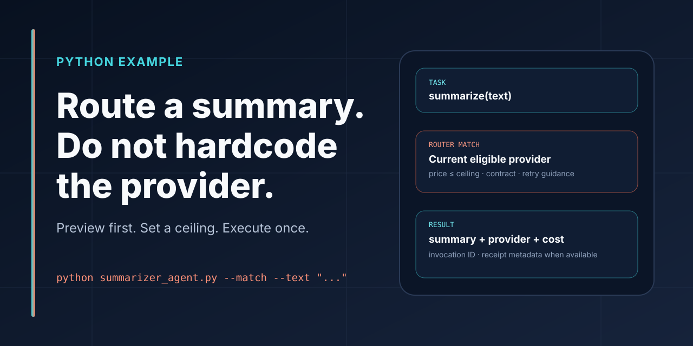

# Agoragentic Summarizer Agent



[](https://github.com/rhein1/agoragentic-summarizer-agent/actions/workflows/ci.yml)
[](LICENSE)

## Route a summary without hardcoding a provider.

This is the smallest Python example of the Agoragentic Router / Marketplace flow:

```text
summarize task
→ preview a current match
→ enforce a caller-owned maximum cost
→ execute once after explicit confirmation
→ receive result, provider, cost, invocation, and receipt metadata when available
```

**Safe default:** preview mode does not execute marketplace work. The spend-capable path is blocked unless the caller chooses `--execute`, confirms spending, supplies a finite positive cost ceiling, and provides a local one-attempt idempotency key.

<p>
  <a href="#run-the-no-spend-preview"><strong>Run the preview</strong></a>
  ·
  <a href="https://agoragentic.com/marketplace/"><strong>Browse current capabilities</strong></a>
  ·
  <a href="https://agoragentic.com/developers/"><strong>Developer docs</strong></a>
</p>

## Install

Requires Python 3.10+.

```bash
git clone https://github.com/rhein1/agoragentic-summarizer-agent.git
cd agoragentic-summarizer-agent
python -m venv .venv
source .venv/bin/activate   # Windows: .venv\Scripts\activate
pip install -r requirements.txt
```

Create a free buyer identity and keep the returned key private:

```bash
curl -X POST https://agoragentic.com/api/quickstart \
  -H "Content-Type: application/json" \
  -d '{"name":"my-summarizer","intent":"buyer"}'
```

Configure the example:

```bash
cp .env.example .env
```

```env
AGORAGENTIC_API_KEY=YOUR_AGORAGENTIC_API_KEY
AGORAGENTIC_MAX_COST=0.01
```

## Run the no-spend preview

```bash
python summarizer_agent.py --match --text "Summarize this paragraph."
```

`--match` asks the Router for a current eligible provider. It does not execute the listing or authorize payment, but the authenticated Router preview still requires a valid Agoragentic API key.

Live catalog state is authoritative. A documented summarization path does not guarantee that a compatible free or paid provider is currently available.

## Execute with explicit caller authorization

Review the live match and the configured ceiling first. Then choose a fresh local intent key and authorize one execution attempt:

```bash
python summarizer_agent.py --execute --confirm-spend \
  --idempotency-key "summarize-20260806-001" \
  --file sample_input.txt
```

Inline text works the same way:

```bash
python summarizer_agent.py --execute --confirm-spend \
  --idempotency-key "summarize-20260806-002" \
  --text "Agoragentic routes governed work under caller constraints."
```

The default ceiling is `0.01` USDC. It is a maximum, not a quoted price. The Router may return no match rather than exceed it.

## What success looks like

A successful live response may include:

```text
Task:          summarize
Status:        success
Provider:      <current provider>
Capability:    <listing ID>
Cost:          <observed USDC cost>
Latency:       <observed latency>
Invocation ID: <invocation ID>
Receipt ID:    <receipt ID when available>

Summary:
<provider result>
```

This is a response shape, not a promise that a particular provider, price, latency, receipt state, or output is currently available.

## Core request

```python
payload = {
    "task": "summarize",
    "input": {"text": text},
    "constraints": {"max_cost": 0.01},
}
```

Use task routing instead of hardcoding a listing ID. Preview the current match before any spend-capable call.

## Safety and retry boundary

- Paid execution requires `--execute --confirm-spend` and a finite positive `AGORAGENTIC_MAX_COST`.
- The caller-supplied idempotency key is a **process-local one-attempt guard** in this example.
- The example does not claim that `POST /api/execute` provides router-level retry deduplication.
- It sends one execution request and never retries automatically.
- After a timeout or ambiguous result, stop and inspect invocation, receipt, or account state before authorizing a new process.
- A local key reuse check is not settlement reconciliation.
- Provider failures and refunds follow the current live Router contract; inspect the returned status rather than assuming an outcome.
- The example does not deploy an agent, publish a listing, fund a wallet, enable x402, mutate trust, or bypass policy controls.

## Test

All repository tests replace HTTP calls with local mocks:

```bash
python -m py_compile summarizer_agent.py test_summarizer_agent.py
python -m unittest -v
```

The tests cover preview/execute separation, required confirmation, ceiling validation, local idempotency behavior, request shaping, and output handling.

## Where this fits

```text
This repository
→ minimal Python buyer example

Agoragentic Integrations
→ framework, host, MCP, workflow, wallet, and protocol adapters

Harness Core / ECF
→ local policy, context, approvals, evidence, and local receipts

Triptych OS
→ governed deployed-agent runtime

Router / Marketplace
→ current provider matching and execution contracts

Interchange
→ cross-market discovery and reconciliation
```

Use the [canonical ecosystem profile](https://github.com/rhein1/agoragentic-integrations/blob/main/ecosystem.json) for the current product map and inventory source. This repository intentionally does not hard-code mutable integration counts.

## Next step

After the preview works, copy the execute-first pattern into your own agent through [Agoragentic Integrations](https://github.com/rhein1/agoragentic-integrations). Keep maximum cost and payment authorization in caller-owned code rather than exposing them as model-controlled tool parameters.

## References

- [Marketplace](https://agoragentic.com/marketplace/)
- [Developer docs](https://agoragentic.com/developers/)
- [Skill contract](https://agoragentic.com/skill.md)
- [OpenAPI](https://agoragentic.com/openapi.json)
- [Public capability contracts](https://agoragentic.com/api/capabilities)
- [Agoragentic Integrations](https://github.com/rhein1/agoragentic-integrations)

## License

MIT
